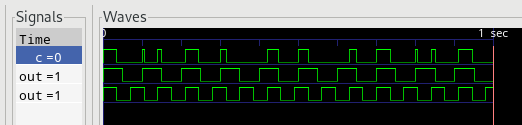

# Hiloz

Hiloz is a work-in-progress **digital system simulator**. Write a model in a
simple description language, run the simulator, and observe the state of your
system over time using a VCD-compatible wave viewer like
[GtkWave](http://gtkwave.sourceforge.net/).

```
define component Clock {
    pin out;
    var delay;

    constructor(period) {
        delay = period / 2;
    }

    script {
        loop {
            out <- !out;
            sleep(delay);
        }
    }
}

define component AndGate {
    pin a;
    pin b;
    pin c;

    script {
        loop {
            trigger;
            c <- a && b;
        }
    }
}

component clk1 = Clock(100);
component clk2 = Clock(70);
component and = AndGate();

connect(clk1.out, and.a);
connect(clk2.out, and.b);
```



## Goals

- A Sub-component system, to allow creating new component definitions from
  smaller building blocks.
- Seed the system with external input, allowing it to be used as a kind of
  electronic system debugger in combination with a logic analyzer.
- Allow embedded system firmware to be compiled with a Hiloz-provided stub HAL,
  running the firmware as an external program to add a microcontroller to your
  simulation.

## Is this an HDL?

The models do look rather similar to something like VHDL or Verilog, but this
isn't really an HDL. You can't synthesize it to an FPGA, and it aims to offer
more abstraction than would generally be possible in something that could target
hardware. 

## Is this a programming language?

Component definitions contain simple scripts in their `constructor` and `script`
blocks, but Hiloz isn't useful as a general-purpose programming language.

This is mainly down to its timing characteristics. In Python, `time.sleep(1000)`
would wait 1000 real-life seconds. In a Hiloz script, `sleep(1000)` will wait
1000 virtual time units as fast as your machine can do that.

## Documentation

There's not loads yet - sorry. If you're willing to tinker, the example above
showcases pretty much all of Hiloz's component description and scripting
features.

A script can do an infinite amount of processing in zero time. Time only passes
in the simulation when all scripts are _suspended_ - that is, they are
`sleep`ing or waiting for a `trigger` (any pin to change).

If you use VS Code, then you can install the
[vscode-highlight](https://marketplace.visualstudio.com/items?itemName=fabiospampinato.vscode-highlight)
extension and grab the settings from `.vscode/settings.json` in this repo.
This will give some very basic syntax highlighting to your models.
